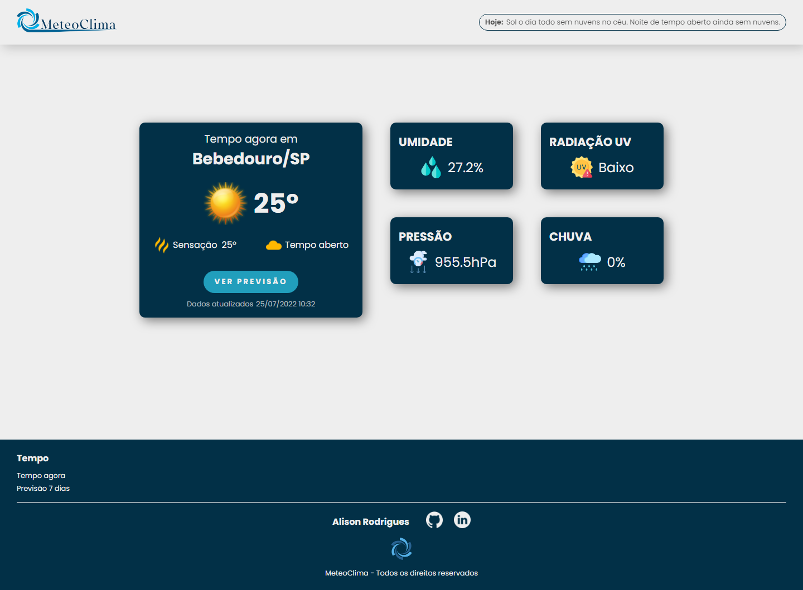
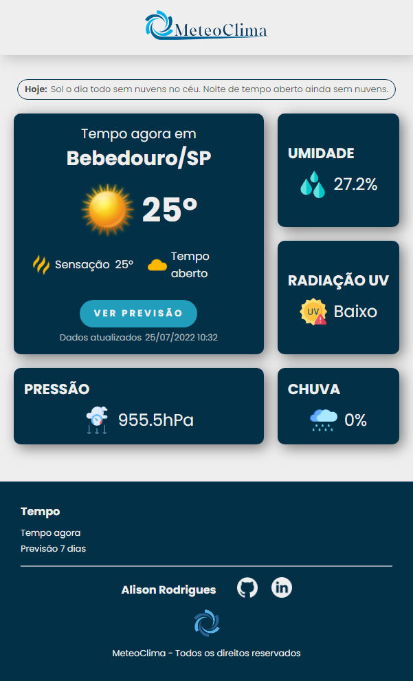
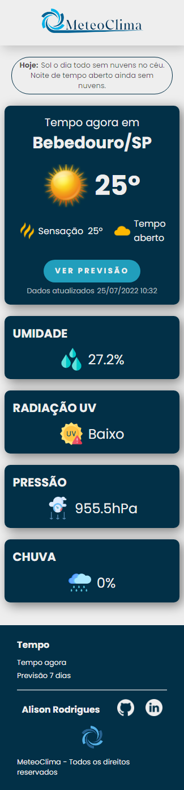
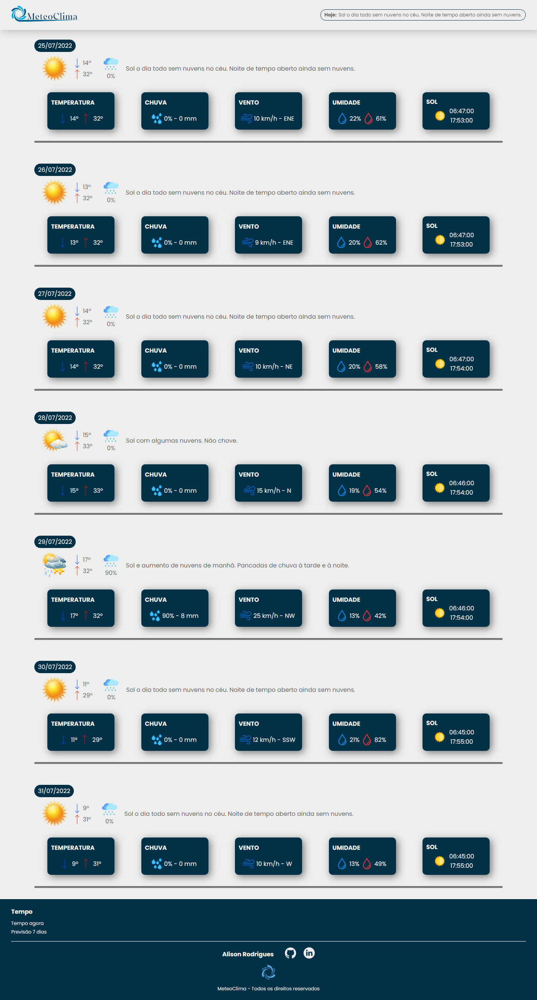
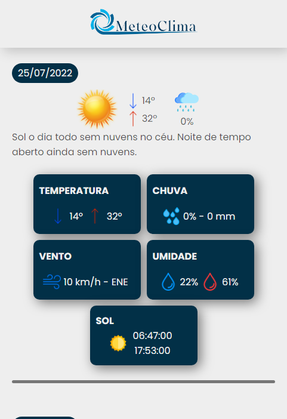
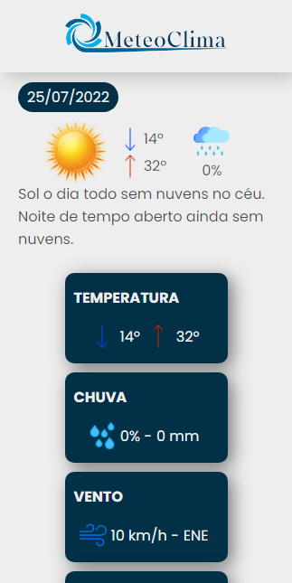

# Estação Meteorológica

Aplicação de uma estação meteorológica que a principio recebe dados da API do ClimaTempo e posteriormente irá receber dados de um Arduino.

## Tecnologias utilizadas Front-end
* Angular
* TypeScript
* HTML
* CSS

## Tecnologias utilizadas Back-end
* Java
* Spring Boot
* PostgreSQL
* Heroku
* API ClimaTempo

## Tecnologias utilizadas no Arduino
* Arduino IDE
* Arduino Uno
* Sensor de radiação UV
* Sensor de pressão, umidade e temperatura BME280
* Sensor de chuva
* Módulo Wifi ESP8266 esp-01

## Página principal no Desktop
---

## Página principal no Tablet
---
 

## Página principal no celular
---

## Página de previsão no Desktop
---

## Página de previsão no Tablet
---

## Página de previsão no Celular
---

